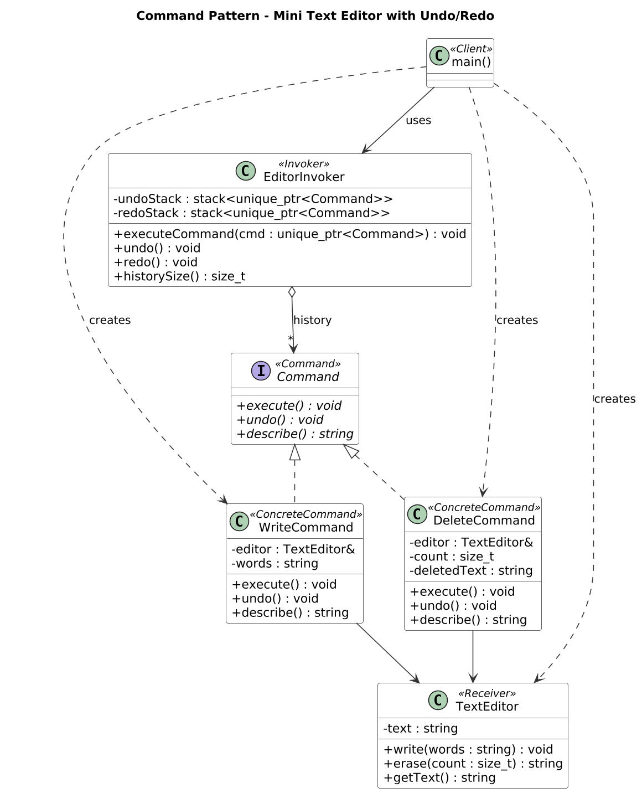

# SWE Lab Project 4 — Command Pattern
**CSE 3206: Software Engineering Sessional · Lab 3 · Group 06**
Rajshahi University of Engineering & Technology (RUET), Department of CSE
Course teacher: Farjana Parvin, Assistant Professor

**Companion repository:** [SWE_Lab_Project_3 — Chain of Responsibility](https://github.com/IbnSinan/SWE_Lab_Project_3)

## Scenario: Mini Text Editor with Undo / Redo
Each editing action (**Write** text, **Delete** characters) is wrapped in a command object that knows how to `execute()` and `undo()` itself. The **EditorInvoker** keeps these commands in two stacks, which gives **Undo** and **Redo**. A new action clears the redo history, just like in Word or VS Code.

## Class diagram


## Files and authors
| File | GoF role | Author |
|---|---|---|
| `TextEditor.h` | Receiver | Shahriar Ahmed Sohan (2203136) |
| `Demo.h` | Client (automatic demo) | Shahriar Ahmed Sohan (2203136) |
| `Command.h` | Command interface | Md. Ibn Sinan Mahdi (2203137) |
| `WriteCommand.h` | Concrete Command | Md. Ibn Sinan Mahdi (2203137) |
| `DeleteCommand.h` | Concrete Command | Md. Ibn Sinan Mahdi (2203137) |
| `EditorInvoker.h` | Invoker (undo/redo stacks) | Md. Amanur Rahman Akash (2203138) |
| `main.cpp` | Client (interactive menu) | Md. Amanur Rahman Akash (2203138) |

## Build and run
```bash
g++ -std=c++17 -Wall -o text_editor main.cpp
./text_editor             # on Windows: text_editor.exe
```
Or use `make run`. The program first runs an automatic demo (write, delete, undo, redo), then opens an interactive menu: 1) Write 2) Delete 3) Undo 4) Redo 0) Exit.

Sample output: [`docs/sample_output.txt`](docs/sample_output.txt) · Execution flow: [`diagrams/command_sequence.png`](diagrams/command_sequence.png)

## Group 06
| Roll | Name |
|---|---|
| 2203136 | Shahriar Ahmed Sohan |
| 2203137 | Md. Ibn Sinan Mahdi |
| 2203138 | Md. Amanur Rahman Akash |
